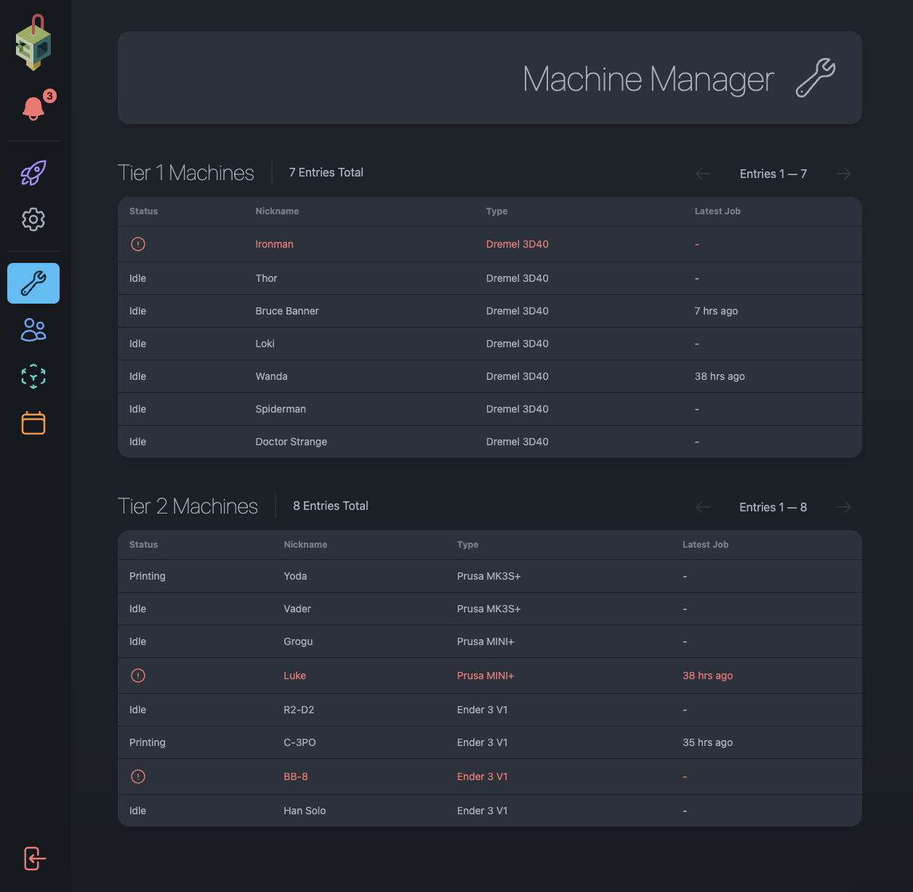
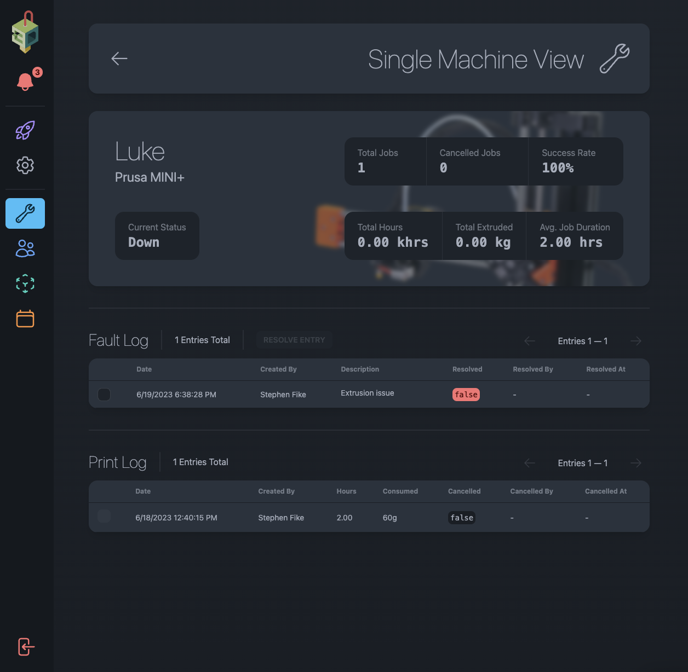
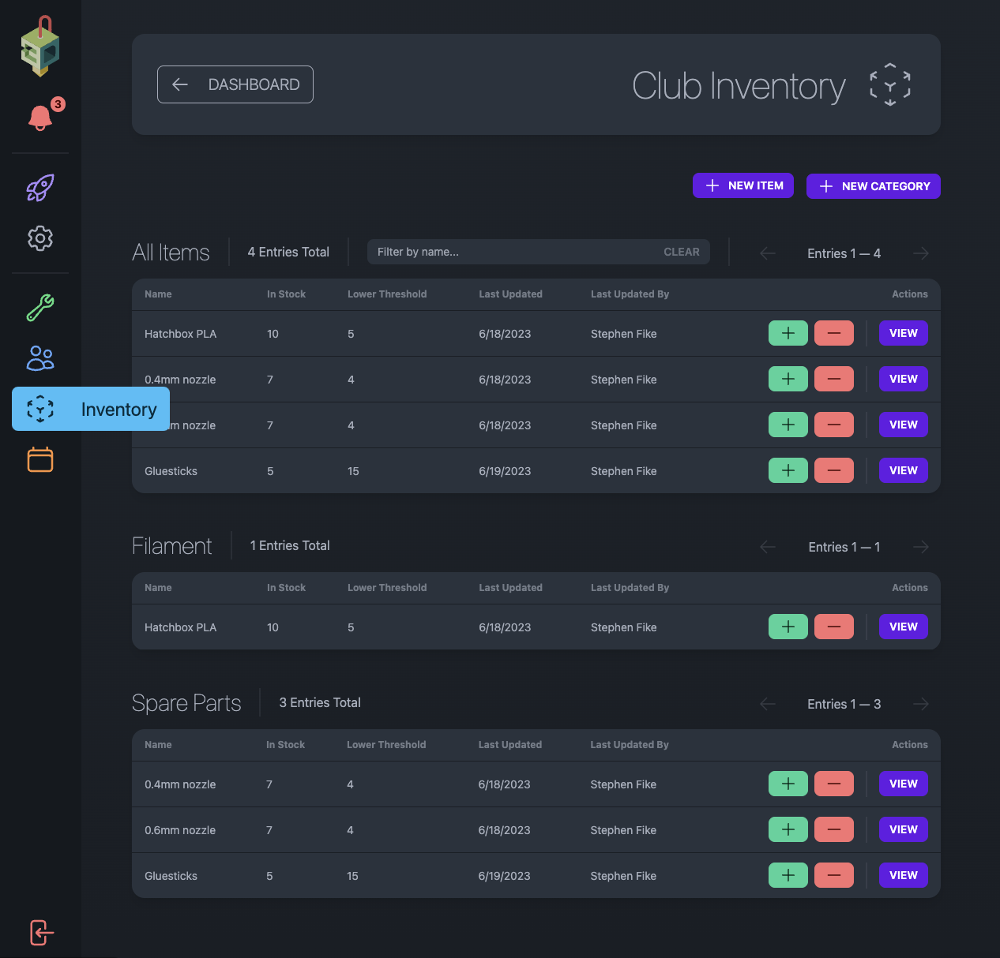
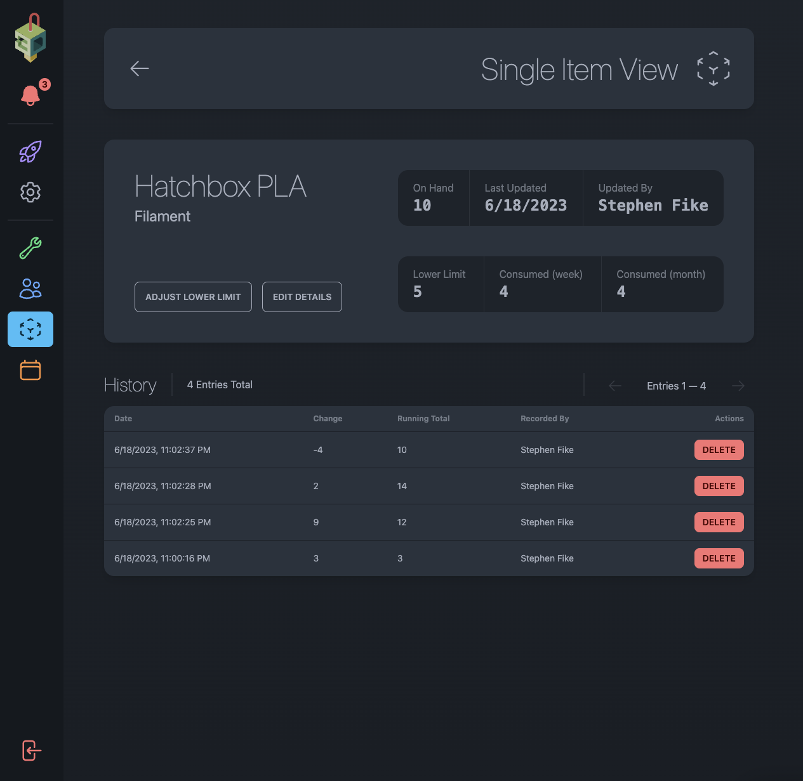
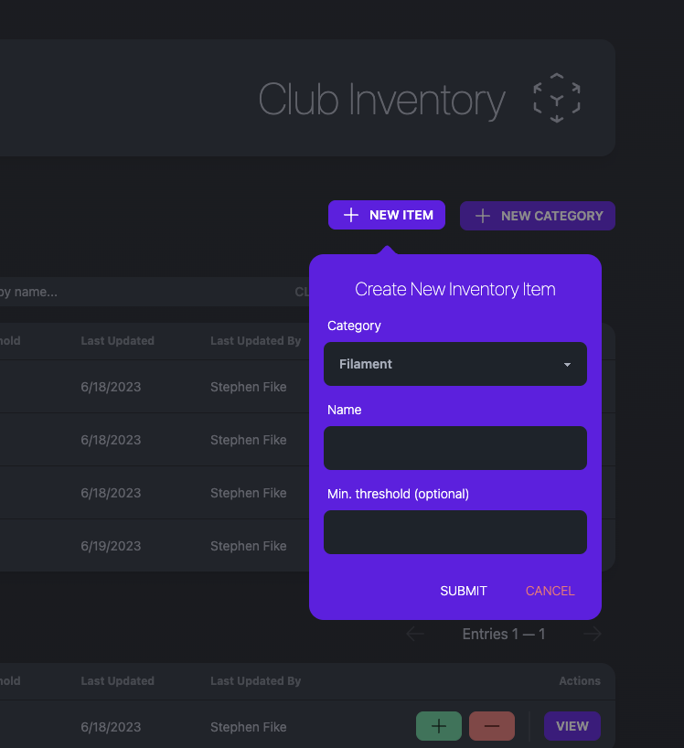
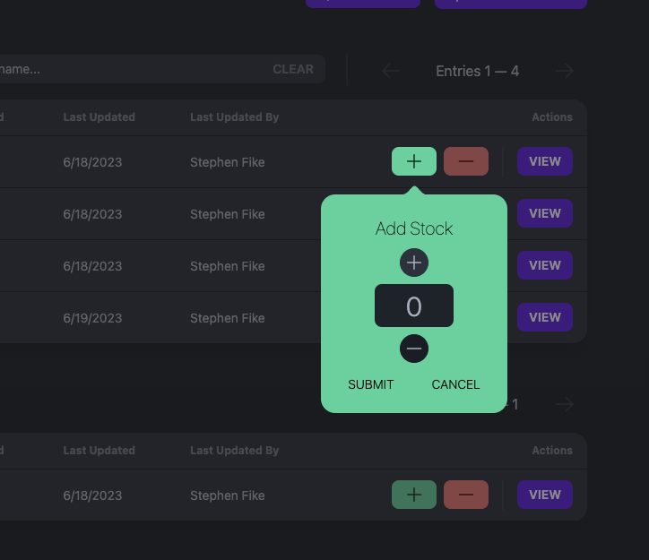
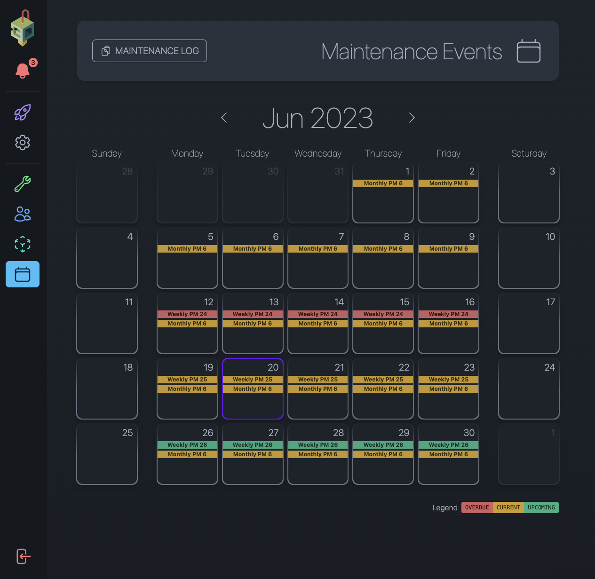
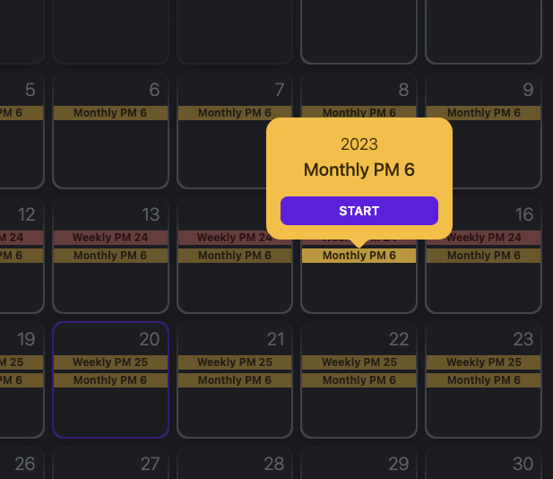
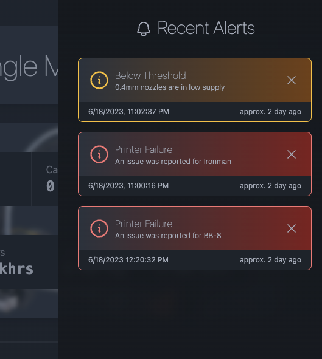

# OSU 3D Club Frontend

Web app that drives the management of all club activities. Currently under development.

# Technologies

* [Supabase](https://supabase.com/) full-stack deployment
    * postgres database
    * third-party auth
    * s3 storage
    * realtime database subscriptions (amazing)
    * it's hip and cool
* [SvelteKit](https://kit.svelte.dev/) framework for sweet sweet SSR

# Photos

## Dashboard

## Machine management

## Inventory system

## Maintenenace system

## Alerts system

